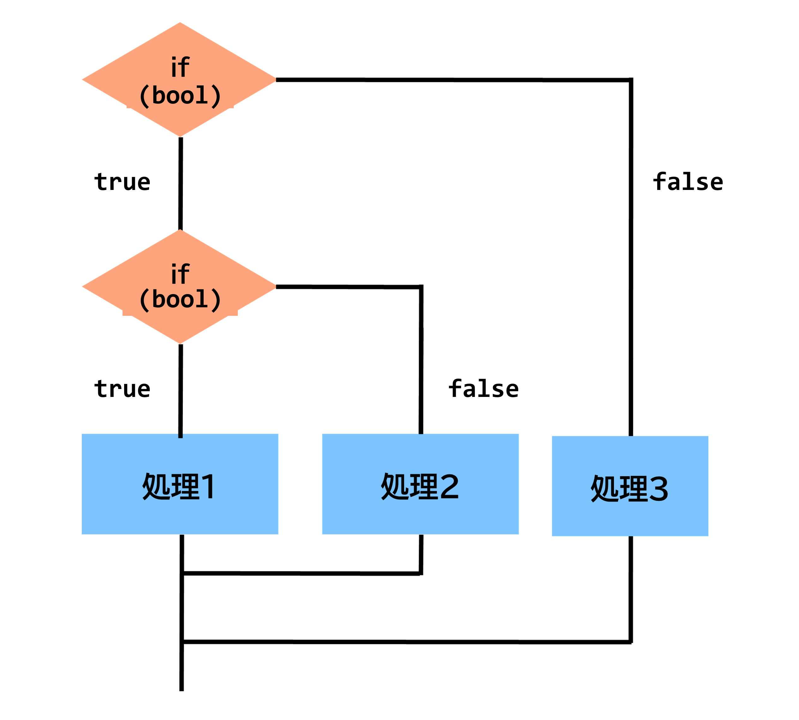
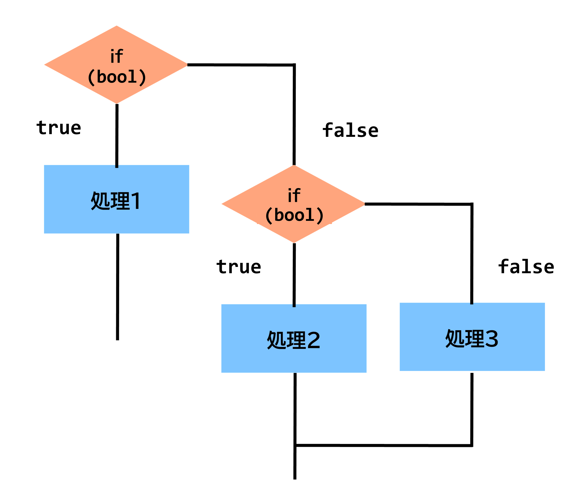

# C++講習 第2回 ~変数，演算子，制御文
## 基本形
まずは例を見てみましょう．
```python
print("Hello, world!")
    ︙
    処理
    ︙
```
Pythonはインタプリタ型言語であるため，基本的に処理は上から順に機械語に翻訳されて実行されます．明示的に流れを変えなければ，処理は*上から順に1度だけ実行されます*．これを**逐次処理**と呼びます．基本中の基本なので必ず覚えておいてください．

### 問題
逐次処理とは何か，説明してください．


## 基本文法
### ブロック
Pythonでは，インデント(行頭の空白)の幅でブロックの範囲を示します．ブロックとは，処理上の塊のようなものです．後ほど詳しく説明します．

### セミコロン
多くのプログラミング言語では区切りにセミコロン`;`を用いますが，Pythonではこれは不要です．

### コメント
プログラム中にプログラムに影響を与えないコメントを挿入することができます．
```python
#コメント
```
VSCodeでは範囲を選択して`Ctrl`+`/`を押すことで一括でコメントにすることができます．ある範囲や行をコメントにすることを **コメントアウトする** といい，メモのほか**デバッグ時に一時的にコードを無効化する**際にも用いられます．  
※**デバッグ**とは，バグ(プログラムの不具合)を究明して解消することをいいます．決してデバッ*ク*ではありません．

## 変数
変数とは，数や文字を入れる箱のようなものです．

  

まずは例を見てみましょう．
```python
a = 16
print(a)
```
上の例では，aという箱を生成し，その箱に16という値を代入し，それを表示しています．  

### 型
変数には **型** があります．型は箱に入る値の種類を表しますが，Pythonではこの型の定義を入れる値に応じて動的に変更してくれます(動的型付言語)．学習段階で型を意識する必要はありません．

| 型    | 入る値             |
| ----- | ------------------ |
| int   | 整数               |
| float | 実数               |
| str   | 文字列             |
| bool  | 真偽値(True,False) |


### 宣言と代入
箱を生成することを，**変数を宣言する** といいます．そして，宣言した変数に値を入れることを**代入**といいます．宣言と代入は常に同時に行います(最初の代入を初期化という)．代入は，
```python
変数名 = 値
```
の形で行います．注意してほしいのが，**`=`は代入であって同値という意味ではない**ということです．**`=`は同値ではなく代入**．*`=`は同値ではなく代入*．一度声に出して読んでみてください．**せーの！「`=`は，同値ではなく，代入！！！！！」**


**これだけ強調しても間違える人が絶対に1人はいます．** くれぐれも注意してください．~~間違えた人には大きな声で「=は同値ではなく代入！」と叫びましょう~~ **`=`は同値ではなく代入**

#### 問題
(1) 以下にあてはまる語句を埋めよ．  
**`=`は(　A　)ではなく(　B　)．**

(2) C++において，`=`はどういう意味か説明してください．


### `print`記法に関して
`print`を用いると，様々な値を出力することができます．

例えば，変数aの中身を表示したい場合，以下のようになります．
```python
a = 1
print(a)
```
期待される出力結果は`1`です．また，複数の値や文字列を結合したい場合，以下のようにします．
```python
a = 1
b = 2
print("aの値は" + str(a) + ", bの値は" + str(b) + "です")
```
期待される実行結果は`aの値は1, bの値は2です`となります．ここでは，標準関数の`str()`を使うことで整数を文字列に変換し，`"aの値は"`など他の文字列と結合しています．まずは形だけ知っておいてください．

### 問題
変数を2つ用意し，それぞれに1, 2.4を代入して表示してください．

## 演算子
ここでは3種類の演算子を扱います．順番に見ていきましょう．

### 算術演算子
算術演算子は，四則演算をする演算子です．

| 演算子 | 意味   | 算数表記 |
| ------ | ------ | -------- |
| `+`    | たす   | +        |
| `-`    | ひく   | -        |
| `*`    | かける | ×        |
| `/`    | わる   | ÷        |
| `//`   | 商     | ÷        |
| `%`    | あまり | mod      |

変数aに，bを10で割って3たした値を代入するには以下のようになります．
```python
a = b / 10 + 3;
```
また，cにdを5で割ったあまりを代入するには
```python
c = d % 5;
```
となります．

#### 複合代入演算子
計算と代入を同時に行う便利な演算子もあります．

| 演算子 | 意味         |
| ------ | ------------ |
| `+=`   | たして代入   |
| `-=`   | ひいて代入   |
| `*=`   | かけて代入   |
| `/=`   | わって代入   |
| `//=`  | 商を代入     |
| `%=`   | あまりを代入 |

例を見ると使い方がわかります．
```cpp
a = a + 2;  //これと
a += 2;     //これは同じ意味
```


### 論理演算子
論理演算子は，論理計算をする演算子です．比較演算子と合わせて用いられます．意味は理工学部の皆さんであれば容易にわかると思います．

| 演算子 | 意味   | 算数表記 |
| ------ | ------ | -------- |
| `and`  | かつ   | AND      |
| `not`  | でない | NOT      |
| `or`   | または | OR       |

### 比較演算子
比較演算子は，値を比較する演算子です．

| 演算子   | 意味       | 算数表記 |
| -------- | ---------- | -------- |
| `>`      | より大きい | >        |
| `>=`     | 以上       | ≧        |
| **`==`** | **同値**   | =        |
| `<=`     | 以下       | ≦        |
| `<`      | より小さい | <        |

先ほど~~嫌というほど~~強調した同値は`==`です．**くれぐれも間違えないように注意してください！**

### その他
他にもビット演算を行うビット演算子や三項演算子などもあります．ここでは扱いませんが，興味のある人は調べてみてください．

## 条件式
論理演算子と比較演算子を組み合わせて，条件式を作ることができます．ここでは例を出して考えてみましょう．

3が代入されているaという変数と7が代入されているbという変数があるとします．このとき，「aが5以下かつbが5以上」という条件式はこのように表されます．
```python
(a <= 5) and (b > 5)
```
また，この条件式は満たしている，つまり真であるのでこの条件式の持つ値はtrue(1)となります．ここで重要なのが，**条件式は値をもつ**という点です．これを実感するために，以下のプログラムを考えてみてください．
```cpp
a = 3
b = 7
print((a <= 5) and (b > 5))
```
上のプログラムでは，先程考えた条件式の値を表示しています．この結果はどうなるでしょうか？─そうですね，`True`になります．条件式が真だからです．

### 問題
(1) 上のサンプルの値や式を変えて，条件式が値をもつことを実感してください．

(2) 以下の条件式を日本語に，日本語を条件式になおしてください．

(i) `(a != 9) or (b >= 3)`

(ii) `not (a%4 == 1)`

(iii) `not ((b == 0) or (a != 3))`

(iv) 「`a`が`1`でない」かつ「`b`が`3`以下」

(v) 「`a`が`3`未満」または「`a + b`が6以上」

<details><summary>▶解答</summary>

(i) `a`が`9`でない または `b` が3以上

(ii) `a`を`4`で割った余りが`1` でない

(iii) `b`が`0`または`a`が`3`でない でない

(iv) `(a != 1) and (b <= 3)`

(v) `(a < 3) or (a + b >= 6)`

</details>


## 制御文
**制御文**を使うことで，プログラムの流れを変えることができます．これにより，逐次処理の中で条件分岐や繰り返しが実現できます．

### 条件分岐
**`if`文**を使うと，**条件分岐**を作ることができます．  


上のフローチャートは，以下のプログラムで表せます．

```python
if 条件式:
    処理A
else:
    処理B
```
ifのあとの条件式がTrue(真)のとき`if`ブロック内の処理Aが，False(偽)のとき`else`ブロック内の処理Bが実行され，次に進みます．`else`は必ずしも書く必要はありません．

`if`文は，**入れ子**にしたり，**連続**で書くこともできます．



```python
//入れ子の例
if 条件式1:
    if 条件式2:
        処理1
    else:
        処理2
else:
    処理3

```



連続で書くときは，`elif`を用います．

```python
//連続の例
if 条件式1:
    処理1
elif 条件式2:
    処理2
elif 条件式3:
    処理3
```

### 条件繰り返し
**`while`文**を使うと，**条件繰り返し**を作ることができます．

  

上のフローチャートは，以下のプログラムで表せます．
```python
while 条件式:
    処理A
```
whileのあとの条件式がTrue(真)のとき処理Aが，False(偽)のとき次に進みます．処理Aが終わったあと，もう一度上に戻り条件式がTrueかFalseか判別します．条件式がTrue(真)のときはもう一度処理Aが，False(偽)のときはループを抜けて次に進みます．

#### break
`break`を使うと，`break`の時点で最も近いブロックの終わりまで飛ぶことができます．例えば，

```cpp
a = 0;
while a < 3:
    a = a + 1
    if a == 1:
        break
```

この場合，`if`ブロックがなければ`a`が`2`になってから`while`ループを抜けるはずですが，実際は`a`が`1`のときに`break`によって`while`ループを抜けることになります．


基本の制御文はここまでです．以下の2つは`if`と`while`で書き換えられます．

### 回数繰り返し
**`for`文**は，便利な繰り返しの制御文です．例えば，同じ処理を10回繰り返したい場合以下のように書きます．
```python
for i in range(10):
    print(i)
```
0から9までの数字が表示されると思います．`range()`の中の値を変えることで，回数を変えることができます．  
`range()`関数は，数字の増え方・減り方等を詳しく指定することができます．詳しくは調べてみてください．


### 問題
1. `while`文を用いて，1～10までを出力するプログラムを作成してください．
2. `if`文を用いて，ある変数が偶数か奇数かを表示するプログラムを作成してください．
3. `for`文と`range`を用いて，出力結果が`0, 2, 4, 6, 8, 10`となるプログラムを作成してください．


[第1回](1.md)　　　[ホーム](index.md)　　　[第3回](3.md)