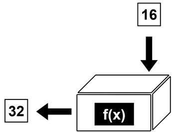

# C++講習 第3回 ~関数，ポインタ，参照
## 関数
関数とは処理をまとめた箱のようなものです．



### 基本
関数は以下のようにして**定義**と**呼び出し**をします．関数において，入力する値を**引数(ひきすう)**，出力される値を**返り値**または**戻り値**といいます．

```cpp
int f(int x){
    return 2 * x;
}

int main(){
    int y;
    y = f(16);
    printf("%d\n", y);
}
```
### 定義
関数を作ることを**定義**といいます．定義は以下のように一般化できます．
```cpp
返り値の型 関数名(引数...){
    処理
    return 返り値;
}
```
型については変数の項を参照してください．上の例では`x`という引数をとり，それを2倍した値を返り値として出力しています．

### 呼び出し
関数を実際に使うことを，**呼び出し**といいます．上の例では関数`f`を7行目で呼び出していて，`y`という変数に`f(16)`の値，ここでは`32`を代入しています．

### スコープ
上の例で`x`という引数を使いましたが，これは`main`関数内で使うことは当然できません．**これは`x`のスコープが関数`f`の中だから**です．**スコープ**とは変数の有効範囲のことで，ブロック内で宣言した変数のスコープはそのブロック内に制限されます．

### ローカルとグローバル
スコープがブロック内に制限されている変数のことを**ローカル変数**といい，スコープが全範囲の変数を**グローバル変数**といいます．ブロックの外で宣言した変数はすべてグローバル変数になります．

### 返り値のない関数
特に組み込み系の制御では，関数に返り値を必要としない場合がよくあります．このとき，返り値の型として **`void`** を使います．よく使うので覚えておいてください．

### プロトタイプ宣言
関数の定義は呼び出しの前に行わないとエラーになりますが，コードが読みにくくなるなどの都合で呼び出しよりあとに定義を行いたいことがあります．このとき，先に宣言だけしておく**プロトタイプ宣言**をします．上の例を書き換えると
```cpp
int f(int x);

int main(){
    int y;
    y = f(16);
    printf("%d\n", y);
}

int f(int x){
    return 2 * x;
}
```
プロトタイプ宣言は，**関数の名前と引数だけを抜き出したもの**です．

### デフォルト引数
関数の引数のデフォルトの値を指定することができます．デフォルトの値は，引数が指定されていないときに用いられます．
```cpp
int f(int x = 5){   //デフォルト引数を指定
    return 2 * x;
}

int main(){
    int y;
    int z;
    y = f(16);      //これだと返り値は32
    z = f();        //これだと返り値は10
    printf("%d\n", y);
}
```

## アドレスとポインタ
ここは正直かなりめんどくさいです．めんどくさい，というのは概念自体は大して難しくないが~~無駄に~~こんがらがっていて理解するのにリソースを消費する，という意味です．ただ，ここを理解しないと次の参照が理解できないので頑張って付いてきてください．

### アドレス
コンピュータにおいて，実行中の作業はすべて**メモリ**に保存されています(メモリが8GBとか16GBとかいうのはその実行中の作業を保存できる領域のことです)．そのメモリに保存される内容として，実行中のプログラムにおける変数も例外ではありません．この変数が実際にメモリのどの場所に保存されているかを表す値を，変数の住所といった意味をこめて**アドレス**と呼びます．

変数`a`のアドレスは`&a`と表します．以下のプログラムを実行してみてください．
```cpp
int main(){
    int a = 0;
    printf("%d\n", &a);
}
```
変な数字が表示されると思います．これは，実際に`a`という変数が保存されているメモリ上の住所を示しています．メモリのどこに保存されるかはコンピュータの状態によって逐一変化するので，実行するたびにこの値は変動します．

### ポインタ
*ここの説明はかなり邪道です．見る人が見たら怒られるかもしれませんが，個人的に一番わかりやすいと思うのでこの方法で説明します．*  
以下の例を実行してみてください．
```cpp
int main(){
    int a = 0;
    int b = &a;
    printf("%d\n", b);
}
```
`b`という`int`型の変数を立てて，そこに`a`のアドレスを代入しています．一見うまくいくように見えますが，実はこれは誤りです．アドレスは普通の変数と違い，`int`や`float`などの型に代入することができません．ここでアドレスを格納するための新たな型を用います．それが**ポインタ**と呼ばれる，`int*`型などの変数です．  
上記の正しいプログラムはこうなります．
```cpp
int main(){
    int a = 0;
    int* b = &a;
    printf("%d\n", b);
}
```
同様に，`float`の変数のアドレスは`float*`型のポインタに，`char`型の変数のアドレスは`char*`型のポインタに代入する，といった形になります．アドレスを代入するため専用の`*`型の変数があるんだな，と理解してもらえるとわかりやすいと思います．

### ポインタの中身を見る
ここで，このような例を実行するとどうなるでしょうか．
```cpp
int main(){
    int a = 0;
    int* b = &a;
    printf("%d\n", *b);
}
```
`0`が表示されたと思います．これは紛れもなく`a`の内容です．このように，**ポインタの名前の前に`*`をつけるとそのポインタに格納されたアドレスの先にある変数の中身を見ることができます．** 理解するのに少し時間がかかると思いますが，ここを理解してから次に進んでください．

### 問題
`c`という変数を4で初期化し，`d`というポインタに`c`のアドレスを代入し，`d`を用いて`c`の値と`c`のアドレスをそれぞれ表示するプログラムを書いてください．

### 補足
ここがさらに話をややこしくする原因なのですが，一応書いておきます．
```cpp
int* a;     //これと
int *a;     //これは同じ意味
```
`int*`型という理解に反してしまいますが，上記の2例は同じ意味になります．これは読めれば大丈夫です．

### 関数にポインタを渡す
例えば，以下のプログラムを実行するとどうなるでしょうか．
```cpp
void func(int x){
    x++;
}
int main(){
    int a = 4;
    func(a);
    printf("%d\n", a);
}
```
期待される実行結果は`5`ですが，実際の実行結果は`4`です．なぜか．これは，関数が**値渡し**だからです．`main`内6行目で`func`に`a`を渡していますが，これは`a`の値の`4`を渡しているだけであって，`func(4);`と書いているのと変わりません．つまり，**呼び出しの時点で`変数a`という情報が失われてしまっている**のです． これを解消するにはどうすればいいでしょうか．関数にアドレスを渡してやれば，`a`という情報を保てそうです．
```cpp
void func(int* x){
    *x++;
}
int main(){
    int a = 4;
    func(&a);
    printf("%d\n", a);
}
```
書き直した例では，引数がポインタになっています．この`int*`型のポインタに`a`のアドレス，つまり`&a`を渡してやります．この関数の中では，*渡されたアドレスの先にある変数の中身を見*て，その変数を1加算します．それによって，`a`が`5`になり，出力として`5`が表示されるということです．

#### 問題
2つの引数に対し，それぞれを2倍する関数をポインタ渡しを使って書き，`main`内で呼び出してみてください．

## 参照
アドレスとポインタをやってみて，おそらく全員が「めんどくさい」と感じたことと思います．実はアドレスとポインタの概念はC++のもととなったC言語の時代に実装された概念であり，C++では非推奨になっています．これを書きやすくした**参照**という概念を学びます．

### 参照とは
アドレスとポインタを単純化したものです．
```cpp
int y = 8;
int &x = y;
printf("%d\n", x);
```
こうすると，ポインタとアドレスを用いることなく`y`を用いずに`y`の内容を参照することができます．**変数に別名をつける**と考えるとわかりやすいかもしれません．

### ポインタ渡しと参照渡しの書き換え
先ほど苦労したポインタ渡しの関数は，以下のように**参照渡し**で書き換えることができます．
```cpp
void funcA(int* x){
    *x++;
}               //これと

void funcB(int &x){
    x++;
}               //これの処理は同じ

int main(){
    int a = 4;
    int b = 4;
    funcA(&a);  //アドレスを渡す
    funcB(b);   //変数そのものを渡す
    printf("%d, %d\n", a, b);
}
```
こうすることで，**変数の情報を保ったまま関数内で用いる**ことができます．自分なりにかみ砕いて理解してみてください．

### 問題
先の問題の答えを参照渡しで書き換えてみてください．

今後はアドレスとポインタは用いず，参照を用いていきます．

[第2回](2.md)　　　[ホーム](index.md)　　　[第4回](4.md)